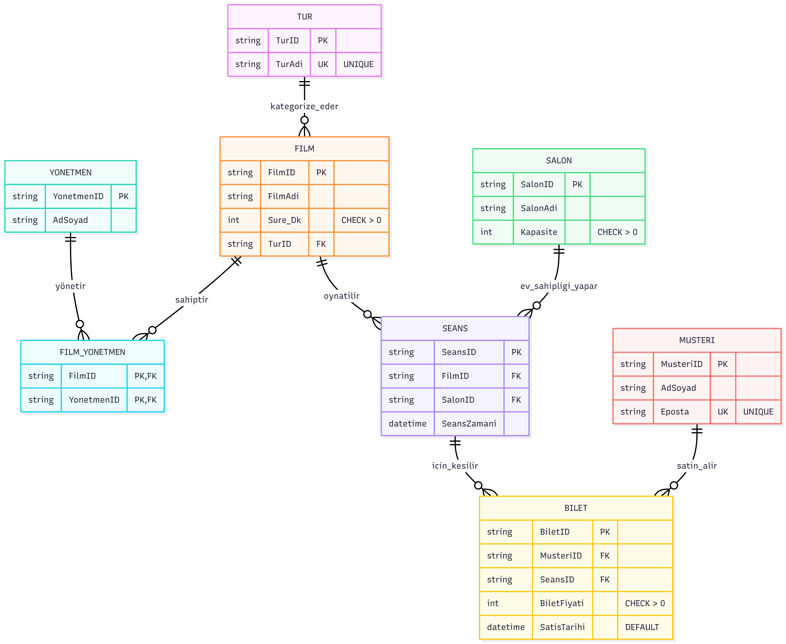
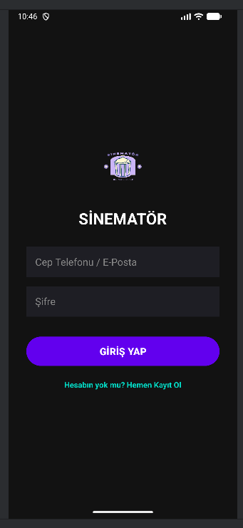
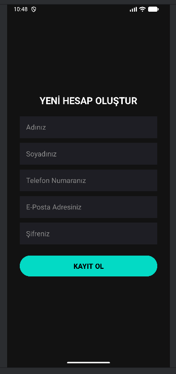
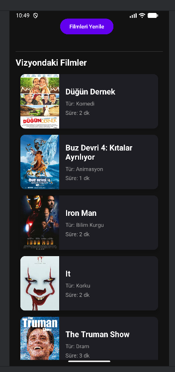
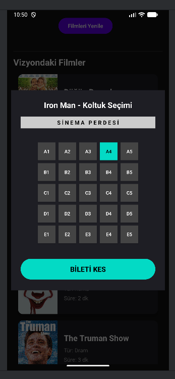
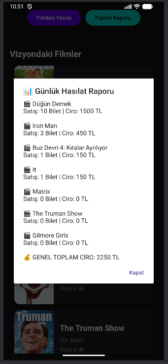

# SİNEMATÖR: Sinema Gişe ve Biletleme Sistemi

## 1. Proje Özeti ve Genel Yapı
- Bu proje, sinema gişe ve biletleme işlemlerini dijital ortamda yönetmek için geliştirilmiştir.
- Kullanıcılar vizyondaki filmleri görüntüleyebilir, koltuk seçebilir ve ödeme adımına geçebilir.
- Yönetici paneli üzerinden film ekleme, düzenleme ve silme işlemleri yapılabilir.
- Proje; arayüz, sunucu ve veritabanı bileşenlerinden oluşmaktadır.

## 2. Problem Tanımı
Geleneksel sinema gişelerinde manuel olarak yürütülen bilet satış, koltuk rezervasyon, seans takibi ve salon kapasite yönetim işlemleri veri karmaşasına, tekrarlı koltuk satışlarına ve performans kayıplarına yol açmaktadır.

## 3. Geliştirme Ortamı
- **Arayüz:** WEB - HTML, CSS, JavaScript, Mobil - Java, Android SDK, Retrofit, XML 
- **Sunucu:** Node.js, Express.js 
- **Veritabanı:** Microsoft SQL Server
- **Kullanılan paketler:** `express`, `cors`, `mssql`, `Tedious` 
- **Geliştirme aracı:** Visual Studio Code
- **Paket yönetimi:** `npm`
- **Araçlar:** Android Studio, VS Code, Git 

## Projenin Yüklenmesi ve Çalıştırılması

1. **Projeyi klonlayın:**
   ```bash
   git clone [https://github.com/meryemDemir00/VTYS_Sinema_Gise.git](https://github.com/meryemDemir00/VTYS_Sinema_Gise.git)
2. **Backend'i çalıştırın:**
   ```bash
   cd VTYS_Sinema_Gise
   npm install
   node server.js
   npm run dev
3. **Android: Android Studio ile projeyi açın ve emülatör üzerinden çalıştırın.**

## Yapılan Araştırmalar
Frontend tarafında DOM event yönetimi, form state kontrolü, input focus/caret davranışı ve direction, unicode-bidi gibi CSS özellikleri araştırılmıştır.

Backend tarafında ise Express.js ile REST API geliştirme, SQL Server bağlantısı, MSSQL paketi ile sorgu çalıştırma ve CRUD işlemleri üzerine araştırma yapılmıştır.

Veri mimari tarafında; ilişkisel veritabanı modellemesi, veritabanı normalizasyonu, veri bütünlüğünü sağlamak adına Trigger (Tetikleyici) ve Stored Procedure (Saklı Yordam) kullanımı gibi ileri düzey veritabanı yönetimi teknikleri üzerinde çalışmalar yapılmıştır.

### Veritabanı İlişki Diyagramı (ERD)


## 4. Yazılım Mimarisi
Projede istemci-sunucu mimarisi benimsenmiştir. Arayüz tarafı kullanıcı etkileşimlerini yönetmekte, form işlemlerini kontrol etmekte ve backend API’den gelen verileri ekranda göstermektedir.

Sunucu tarafında Node.js ve Express.js kullanılmıştır. Express sunucusu, film, salon, seans, müşteri ve bilet işlemleri için API uç noktaları sunmaktadır. Veriler Microsoft SQL Server veritabanında saklanmaktadır. Sunucu ile veritabanı arasındaki bağlantı mssql kütüphanesi ile sağlanmıştır.

Uygulama; Mobil Arayüz, Node.js API Sunucusu ve SQL Server olmak üzere üç katmanlı bir yapıda tasarlanmıştır. Mobil uygulama, Retrofit aracılığıyla JSON formatında verileri API'ye gönderir, Node.js sunucusu veritabanı ile etkileşime girer ve işlem sonuçlarını yine JSON olarak uygulamaya geri döner. Bu yapı, sistemin ölçeklenebilir ve güvenli olmasını sağlar.

## Geliştirme aşamaları genel olarak şu şekilde ilerlemiştir:
1.      Proje gereksinimlerinin belirlenmesi
2.      Veritabanı tablolarının ve ilişkilerinin tasarlanması
3.      Backend API uç noktalarının oluşturulması
4.      Ana sayfa, detay, koltuk seçimi, ödeme ve admin ekranlarının geliştirilmesi
5.      Form doğrulama ve kullanıcı deneyimi iyileştirmeleri
6.      Veri senkronizasyonu ve hata yönetimi düzenlemeleri
7.      Poster, ödeme formu ve yönlendirme gibi kullanıcı kaynaklı hataların düzeltilmesi
8.      Son testler ve raporlama

## Arayüz Özellikleri
### Ana sayfada vizyondaki filmler listelenir.

### Film detay ekranı üzerinden seans ve koltuk seçimi yapılır.

### Ödeme ekranında kullanıcı bilgileri girilir ve işlem tamamlanır.

### Admin panelinde film ekleme, düzenleme ve silme işlemleri bulunur.

### Mobil Arayüzü






## Akış Şeması
```mermaid
graph TD
    A[Başla] --> B[Kullanıcı Girişi]
    B --> C[Film Seçimi]
    C --> D[Seans Seçimi]
    D --> E[Koltuk Seçimi]
    E --> F{Müsait mi?}
    F -- EVET --> G[Ödeme]
    F -- HAYIR --> E
    G --> H[Bilet Satış İşlemi]
    H --> I[Trigger Çalışır]
    I --> J[QR Kod Üretimi]
    J --> K[BİTİŞ]